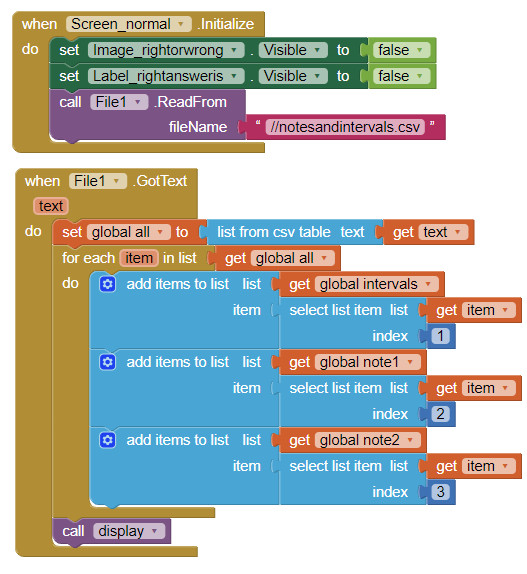

# app_inventor
## 常见错误
* 变量名出错
* 逻辑出错
## 技巧
- 用数据库的不变性来进行各屏幕之间的参数传递
- 切换屏幕的时候要记得关闭本屏幕
    - [Rember to close the current screen](closecurrentscreen.jpg)
## 发布
* `https://play.google.com/apps/publish/?account=5934462972948485741#ManageReleaseTrackPlace:p=appinventor.ai_cdutboy928.schedule_english&appid=4974029659287825923&releaseTrackId=4701037977174453843`
* `http://app.baidu.com/apps`
* `https://open.qq.com/regv2/prove_page/`
* `https://id1.cloud.huawei.com/CAS/portal/loginAuth.html?validated=true&themeName=red&service=https%3A%2F%2Foauth-login1.cloud.huawei.com%2Foauth2%2Fv2%2Flogin%3Faccess_type%3Doffline%26client_id%3D6099200%26display%3Dpage%26h%3D1587920391.2020%26lang%3Dzh-cn%26redirect_uri%3Dhttps%253A%252F%252Fdeveloper.huawei.com%252Fconsumer%252Fcn%252Fservice%252Fjosp%252Fagc%252FhandleLogin.html%26response_type%3Dcode%26state%3D2157922%26v%3D6f63c3512851e81243b672f151a726247779f00f3824a059ee7fb581a1f267ba&loginChannel=89000000&reqClientType=89&lang=zh-cn&clientID=6099200`

**但是，除了Google Play上面，其他的都需要版权证明，需要费用。**

## [activity starter](http://ai2inventor.blogspot.com/2016/12/using-activity-starter-component.html)
Activity Starter可以打开手机上任何的APP甚至是APP里的任何activity。
有两种方法，两种方法只取其一，在Designer和Blocks界面赋值的效果是相同的(如果是要调用默认的app,就不要把Designer界面的ExternalApp勾上）：
* 一种是给action赋值
    * Open a facebook:
    	* Action: android.intent.action.VIEW (Starts an app)
    	* DataUri: http://www.facebook.com 8 (The URL. If you forget the “http://” or “https://” it won’t work and will give you an error)
    * Play a YT video:
    	* Action: android.intent.VIEW
    	* DataUri: vnd.youtube:video id here (starts playing a YT video)
    *  to open the phone’s browser to a designated web page
    	* Action: android.intent.action.VIEW
    	* DataUri: http://mit.edu
    * To start the Android mailer application
	* Action: android.intent.action.VIEW
	* DataUri: mailto:santa@northpole.com
    * to show a map of the area
	* Action: android.intent.action.VIEW
	* DataUri: geo:37.8,-122.23?z=10
    * If you know a zip code of a location, you can set the activity starter properties as follows:
	* Action: android.intent.action.VIEW
	* DataUri: geo:0,0?q=94043
    * If you have a street address, you can use a DataUri that encodes the address with a scheme called URL encoding :
	* Action: android.intent.action.VIEW
	* DataUri: geo:0,0?q=77+Massachusetts+Avenue%2C+Cambridge%2C+MA
    * Select a contact
	* Action: android.intent.action.PICK
    * Starting  an external app to pick files
	* Action: android.intent.action.PICK
	* dataType: vnd.android.cursor.dir/lysesoft.andexplorer.file
	* dataURI: file:///sdcard
* 一种是给ActivityClass和ActivityPackage赋值（注意用这种方法赋值时候，Datauri和aaction都不必清空）。

给上述的参数赋值的标准方法是用logcat，在手机上进行想要的操作，然后通过查找`/.*START.* eudic`来确定上述的参数，手机上的"activity manager"可以用来参考要查找的名称。  
对于查找到的片段，
* 比如`04-29 17:59:09.872  1404 16355 I ActivityManager: START u0 {act=android.intent.action.MAIN cat=[android.intent.category.LAUNCHER] flg=0x10200000 cmp=com.eusoft.eudic/com.eusoft.dict.activity.SplashActivity bnds=[128,866][387,1126]} from uid 10028 on display 0`
	* `act=android.intent.action.MAIN` 表示action是`android.intent.action.MAIN`
	* `cmp=com.eusoft.eudic/com.eusoft.dict.activity.SplashActivity`表示ActivityClass是`com.eusoft.dict.activity.SplashActivity`,ActivityPackage是`com.eusoft.eudic`
* `I/ActivityManager(   86): Starting activity: Intent { act=android.intent.action.VIEW dat=vnd.youtube:nAPk9ycCbfc cmp=com.google.android.youtube/.PlayerActivity }`
  * If you can find the "cmp=" string, then the ActivityPackage is the part before the slash, e.g.,  com.google.android.youtube.  The ActivityClass is is the entire "cmp=" part, without the slash character, e.g., com.google.android.youtube.PlayerActivity.   There may also in general be "dat=" information that should be specify as the DataUri property.
* Use these parameter to open a profile page or an image directly with Instagram app
    * 
    * 
??? permission denial when opening xiaocao???

## Use player component instead of audio component to avoid the "Error 703: Unable to play *.mp3" error
## how to delay in app inventor
* 
* 
## 有时候枚举法反而更方便

## list
* 读取从csv文件并按每一列生成一个列表 
    * 
    * 如果csv文件有多列，则每一行是作为一个item的
## about loop
But the general rule is: if a loop will last more than a couple of seconds avoid using for or while loops in App Inventor.Taifun's Clock Timer solution will work for continuous polling which is what you are doing.The difference is, that in your case, you would not need a counter variable.
* 
